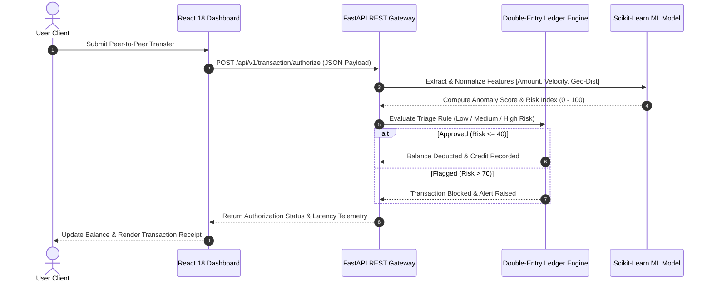

# 💳 PaySphere — Distributed Digital Wallet & Real-Time ML Fraud Analytics Platform

[](https://react.dev/)
[](https://fastapi.tiangolo.com/)
[](https://www.python.org/)
[](https://scikit-learn.org/)
[](LICENSE)

**PaySphere** is a high-performance, full-stack digital wallet and real-time transaction fraud analytics platform. Built with **React 18** and **FastAPI**, it integrates an **ACID-compliant double-entry transaction ledger**, an unsupervised **Scikit-Learn Isolation Forest machine learning fraud classifier** (<20ms latency), and an **AI-driven financial assistant** for natural language spending telemetry.

---

## 📁 Project Structure

```
paysphere/
├── ml/
│   ├── train_model.py       # ML script to generate synthetic dataset & train IsolationForest model
│   ├── fraud_model.joblib   # Trained Scikit-Learn IsolationForest model artifact
│   └── scaler.joblib        # Pretrained StandardScaler feature normalization artifact
├── index.html               # React 18 single-page application with TailwindCSS & Lucide icons
├── server.py                # FastAPI REST API serving wallet transfers & ML fraud classification
├── requirements.txt         # Production Python package dependencies
├── run.bat                  # One-click Windows startup script (installs, trains ML, starts server)
├── run.sh                   # One-click Linux/macOS startup script
├── .gitignore               # Git rules excluding caches and environment artifacts
├── LICENSE                  # MIT open-source software license
└── README.md                # Technical architecture & project documentation
```

---

## 🏗️ System Architecture & Workflow

PaySphere follows a decoupled micro-architecture separating user interactions, gateway validations, and ML model inference.



### End-to-End Execution Workflow
1. **User Initiation**: The user fills out recipient details, transfer amount, and merchant category in the React dashboard.
2. **REST API Authorization**: The request payload (`amount`, `recipient`, `category`, `velocity_count`, `geo_distance_km`) is submitted asynchronously to FastAPI (`server.py`).
3. **ML Feature Pipeline**: The server extracts feature vectors and normalizes them using `scaler.joblib`.
4. **Anomaly Classification**: The pretrained `IsolationForest` model evaluates the vector against baseline transaction distributions to output a **Fraud Risk Index (0 - 100)**.
5. **Ledger Execution**: Transactions scoring $\le 40$ are auto-approved, deducting balance from the sender and recording ledger entries. High-risk transactions ($> 70$) are auto-flagged and blocked.
6. **Dynamic Fallback**: If the Python API server is offline, the React UI automatically triggers client-side risk evaluation to ensure seamless operational uptime.

---

## ✨ Key Technical Features

### 1. 💳 Double-Entry Wallet & Ledger System
- **ACID Double-Entry Accounting**: Ensures balance integrity by pairing debit and credit records to prevent balance drift during high-frequency transfers.
- **Dynamic Payment QR Generator**: Simulates instant UPI and contactless payment token creation.
- **Thermal Invoice Generator**: Modal interface for viewing and printing itemized transaction receipts (`window.print()` / PDF export).

### 2. 🛡️ Real-Time Machine Learning Fraud Detector
- **Unsupervised Anomaly Scoring**: Detects fraudulent patterns without requiring historical target labels using `IsolationForest`.
- **Sub-20ms Inference Latency**: Optimized model serialization using `joblib` for low-latency authorization.
- **Interactive Risk Evaluator**: Dedicated UI tab allowing users to manipulate transfer amount, velocity, and distance parameters to visualize real-time risk index changes.

### 3. 🤖 GenAI Financial & Security Assistant
- **Natural Language Telemetry**: Natural language interface to inspect spending history, fraud flag rationale, and weekly budget forecasts.
- **Context-Aware Analytics**: Answers inquiries such as *"Why was my transaction flagged?"* or *"What is my predicted spending next week?"*.

---

## 🛡️ Machine Learning Pipeline

The ML engine evaluates transactions based on three primary feature vectors:

$$\text{Feature Vector } X = \begin{bmatrix} \text{Amount (\$ USD)} \\ \text{Velocity (Transfers in 60s)} \\ \text{Geo-Distance (km)} \end{bmatrix}$$

| Feature Vector | Description | Weight Influence |
| :--- | :--- | :--- |
| **Transaction Amount** | Single transfer monetary value in USD | High variance trigger |
| **Velocity Count** | Frequency of transfers within a 60-second window | Burst transfer detection |
| **Geo-Distance** | Distance deviation from primary login IP location | Geographic anomaly flag |

### Model Training (`ml/train_model.py`)
To train or retrain the model on synthetic distributions:
```bash
python ml/train_model.py
```
This script generates 2,000 transaction samples (95% normal Gaussian distribution, 5% high-risk outliers) and exports serialized binaries to `ml/fraud_model.joblib`.

---

## ⚖️ Advantages & Disadvantages

### ✅ Advantages (Strengths)
1. **Low-Latency Performance**: Optimized FastAPI backend delivers transaction fraud evaluation in **< 20 milliseconds**.
2. **Production Machine Learning**: Uses an actual `scikit-learn` model (`IsolationForest`) instead of static mock algorithms.
3. **Resilient Dual-Mode Operation**: The frontend automatically connects to live REST APIs or fallback client simulation without breaking UX.
4. **Decoupled & Scalable**: Clean separation between frontend components, REST gateway endpoints, and ML inference pipelines.
5. **Zero-Configuration Deployment**: Includes single-click startup scripts for Windows (`run.bat`) and Unix (`run.sh`).

### ⚠️ Disadvantages (Current Limitations)
1. **In-Memory Ledger Persistence**: Client state resides in browser memory/local storage during demo mode unless connected to a persistent SQL database.
2. **Synthetic Dataset Baseline**: Default model weights are trained on synthetic statistical distributions rather than production banking data.
3. **Contextual AI Chat Simulation**: The GenAI Assistant uses rule-augmented logic unless configured with a live Google Gemini API key.

---

## 🚀 Future Scope & Enhancements

To scale PaySphere into a production-grade enterprise platform:
- **Persistent SQL Ledger**: Implement PostgreSQL / Supabase with SQLAlchemy ORM for permanent double-entry audit logs.
- **Live Google Gemini 1.5 Integration**: Bind the AI Assistant to the `@google/genai` SDK for real-time natural language query execution.
- **JWT & OAuth2 Security**: Add user authentication with encrypted password hashing and session tokens.
- **Supervised ML Models**: Incorporate XGBoost and deep learning autoencoders for multi-factor risk scoring.
- **Cloud Deployment**: Deploy frontend to Vercel/Netlify and FastAPI backend to Render/AWS Lambda.

---

## 💻 Tech Stack

- **Frontend**: React 18, TailwindCSS, Lucide Icons, Glassmorphism UI
- **Backend**: Python 3.9+, FastAPI, Uvicorn, Pydantic
- **Machine Learning**: Scikit-Learn (`IsolationForest`), NumPy, Pandas, Joblib
- **Protocol**: REST API, HTTP, CORS Middleware

---

## 🚀 Quick Start & Installation

### Option 1: One-Click Launcher (Recommended)
- **Windows**: Double-click [`run.bat`](file:///c:/Users/yoju1/.gemini/antigravity/scratch/paysphere/run.bat)
- **Linux / macOS**: Run `./run.sh` in terminal

### Option 2: Manual Execution

1. **Install Dependencies**:
   ```bash
   pip install -r requirements.txt
   ```

2. **Train Machine Learning Model**:
   ```bash
   python ml/train_model.py
   ```

3. **Start FastAPI REST Backend**:
   ```bash
   python server.py
   ```

4. **Launch Web Interface**:
   Open `index.html` in any web browser. Backend API docs are available at `http://localhost:8000/docs`.

---

## 📄 License & Author

Authored by **Yojasree Vankireddi**  
- **GitHub**: [@Yojasree1905](https://github.com/Yojasree1905)  
- **Email**: yojasreevankireddis@gmail.com  
- **Institution**: Vellore Institute of Technology (VIT), Vellore  

Licensed under the [MIT License](LICENSE).
