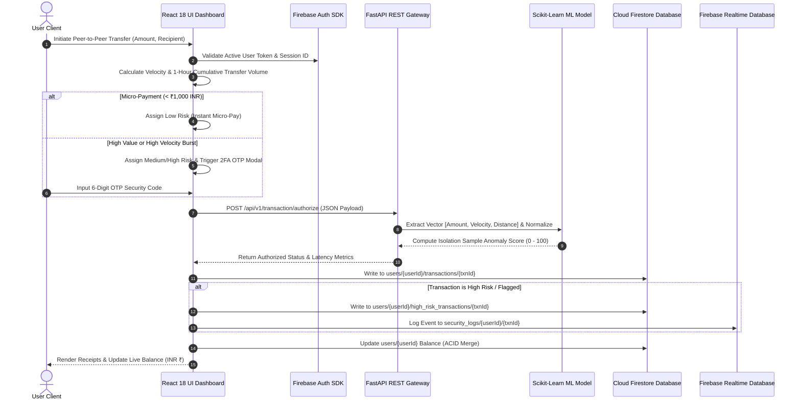

# 💳 PaySphere — Next-Gen Distributed Digital Wallet & Real-Time ML Fraud Analytics Platform

[](https://react.dev/)
[](https://firebase.google.com/)
[](https://fastapi.tiangolo.com/)
[](https://www.python.org/)
[](https://scikit-learn.org/)
[](LICENSE)

**PaySphere** is an enterprise-grade digital wallet application and real-time transaction fraud analytics platform. Built with **React 18**, **Firebase Authentication**, **Cloud Firestore Database**, and **FastAPI**, PaySphere delivers **strict multi-tenant account isolation**, an **automated high-risk security audit subcollection**, a **smart multi-tier risk evaluation matrix with micro-payment exemptions**, an **interactive machine learning fraud simulator**, and an **AI financial advisor**.

---

## 📌 Table of Contents

- [Executive Overview](#-executive-overview)
- [System Architecture & Component Interaction](#-system-architecture--component-interaction)
- [Comprehensive Project Directory Structure](#-comprehensive-project-directory-structure)
- [Cloud Firestore Multi-Tenant Database Schema](#-cloud-firestore-multi-tenant-database-schema)
- [Smart Multi-Tier Risk Evaluation Engine](#-smart-multi-tier-risk-evaluation-engine)
- [Machine Learning Anomaly Detection Model](#-machine-learning-anomaly-detection-model)
- [Key Features & Functional Modules](#-key-features--functional-modules)
- [Step-by-Step Execution Workflows](#-step-by-step-execution-workflows)
- [API Reference & REST Endpoints](#-api-reference--rest-endpoints)
- [Installation & Quick Start Guide](#-installation--quick-start-guide)
- [Technical Advantages](#-technical-advantages)
- [License & Author Attribution](#-license--author-attribution)

---

## 🚀 Executive Overview

Modern financial applications require robust security controls that balance user experience with stringent threat detection. PaySphere addresses these challenges by combining:

1. **Authentication & Multi-Tenant Data Isolation**: User access is secured via Firebase Authentication (Email/Password and Google OAuth). Each user account is strictly isolated, ensuring balances, transactions, and security logs are bound strictly to their user ID.
2. **Per-User High-Risk Audit Subcollection**: When transactions trigger high-risk thresholds, they are automatically mirrored into a dedicated `high_risk_transactions` subcollection under that specific user's Firestore document.
3. **Frictionless Micro-Payments (< ₹1,000)**: Routine low-value transfers bypass unnecessary Two-Factor Authentication (2FA) friction, while high-value or rapid burst transactions enforce mandatory 2FA security.
4. **Sub-20ms Machine Learning Inference**: Uses an unsupervised Scikit-Learn `IsolationForest` model trained on standardized feature vectors to score transactions in real-time.
5. **Strict Chronological IST Telemetry**: All transaction dates are parsed using numerical UNIX millisecond epoch timestamps and formatted in Indian Standard Time (`YYYY-MM-DD HH:mm IST`), ensuring newest payments always render at Row #1.

---

## 🏗️ System Architecture & Component Interaction

PaySphere employs a decoupled architecture separating frontend state management, cloud storage authentication, and machine learning REST gateway authorization.



---

## 📁 Comprehensive Project Directory Structure

```
paysphere/
│
├── ml/                                 # Machine Learning Model Pipeline
│   ├── train_model.py                  # Synthetic dataset generator & IsolationForest training script
│   ├── fraud_model.joblib              # Serialized Scikit-Learn IsolationForest model binary
│   └── scaler.joblib                   # Serialized StandardScaler normalization feature matrix
│
├── index.html                          # Main React 18 SPA (Dashboard, Tabs, Form, Receipt Modals, Tailwind CSS)
├── firebase-config.js                  # Firebase Client Initialization (Auth, Firestore, Realtime Database)
├── server.py                           # FastAPI Core Gateway (Serves web UI, Static JS, API Endpoints)
├── requirements.txt                    # Python Production Dependencies (FastAPI, Scikit-Learn, Uvicorn)
├── run.bat                             # One-Click Windows Startup Batch Script
├── run.sh                              # One-Click Linux/macOS Shell Startup Script
├── firestore.rules                     # Cloud Firestore Security Rules Configuration
├── firebase.json                       # Firebase CLI & Hosting Deployment Configuration
├── LICENSE                             # MIT Software License
└── README.md                           # Master Project Architecture & Technical Documentation
```

---

## 🗄️ Cloud Firestore Multi-Tenant Database Schema

PaySphere establishes strict data isolation across Cloud Firestore. Each user document is identified by a sanitized key (`{clean_doc_id}`), preventing cross-account data leaking.

```
Cloud Firestore Root
│
├── users/ (Collection)
│   └── {clean_doc_id}/ (Document, e.g., yoju1907_gmail_com)
│       ├── uid: "USER-1907"
│       ├── email: "yoju1907@gmail.com"
│       ├── balance: 448300.00
│       ├── created_at: "2026-09-03 00:08 IST"
│       ├── last_active: "2026-09-03 01:10 IST"
│       │
│       ├── transactions/ (Subcollection — Isolated User Ledger)
│       │   └── {transaction_id}/ (e.g., TXN-90417)
│       │       ├── amount: 50000.00
│       │       ├── recipient: "Alex Smith"
│       │       ├── category: "Transfer"
│       │       ├── riskProfile: "Medium Risk"
│       │       ├── securityStatus: "🔒 Medium Risk (2FA Verified)"
│       │       ├── timestamp: 1788377000000
│       │       └── date: "2026-09-03 00:46 IST"
│       │
│       └── high_risk_transactions/ (Subcollection — Per-User High Risk Audit Log)
│           ├── __meta__/ (Initialization Anchor Document)
│           └── {transaction_id}/ (e.g., TXN-90417)
│               ├── amount: 500000.00
│               ├── recipient: "Global Exchange Node"
│               ├── riskProfile: "High Risk"
│               └── securityStatus: "⚠️ High Risk (Flagged / High Velocity)"
│
└── transactions/ (Global Collection — System Audit Ledger)
    └── {transaction_id}/
        ├── user_email: "yoju1907@gmail.com"
        └── user_uid: "USER-1907"
```

---

## 🛡️ Smart Multi-Tier Risk Evaluation Engine

Transactions are evaluated in real time through a multi-factor risk engine checking single transfer value, velocity count (transfers within 60 minutes), cumulative volume, and recipient history:

| Risk Profile | Trigger Criteria | User Experience / Security Action |
| :--- | :--- | :--- |
| **`✅ Low Risk (Instant Micro-Pay)`** | Amount < ₹1,000 INR (Micro-payments) | Executed instantly without 2FA modal friction. |
| **`✅ Low Risk (Verified)`** | Amount < ₹50,000 INR (1st or 2nd transfer to recipient in 1 hr) | Executed instantly without modal. |
| **`🔒 Medium Risk (2FA Verified)`** | Amount $\ge$ ₹50,000 INR, Bank Wire, 3rd/4th repeat transfer, or Cumulative $\ge$ ₹100,000 INR | Mandatory 2FA OTP modal verification required. |
| **`⚠️ High Risk (Flagged Alert)`** | Velocity $\ge$ 5 transfers/hr to same person, Cumulative $\ge$ ₹500,000 INR, or Single Amount $\ge$ ₹50 Lakhs | High alert warning badge + 2FA modal + Saved to user's `high_risk_transactions` subcollection. |

---

## 🔬 Machine Learning Anomaly Detection Model

The backend machine learning model utilizes an unsupervised **Isolation Forest** classifier (`IsolationForest`) from Scikit-Learn.

### Feature Matrix Extraction

Given a transaction event $T$, the feature vector $X$ is extracted:

$$X = \begin{bmatrix} x_{\text{amount}} \\ x_{\text{velocity}} \\ x_{\text{distance}} \end{bmatrix} \in \mathbb{R}^3$$

### Mathematical Risk Score Formulation

1. **Standardization**:
   $$X_{\text{scaled}} = \frac{X - \mu}{\sigma}$$

2. **Isolation Forest Sample Scoring**:
   $$s(x, n) = 2^{-\frac{\mathbb{E}(h(x))}{c(n)}}$$
   Where $h(x)$ is the path length of observation $x$, $\mathbb{E}(h(x))$ is the average path length across isolation trees, and $c(n)$ is the average path length of unsuccessful searches in a Binary Search Tree.

3. **Composite Risk Index Computation**:
   $$\text{Risk Score} = \min\left(99, \max\left(5, \text{Score}_{\text{base}} + 30 \cdot |s(x, n)|\right)\right)$$

---

## ✨ Key Features & Functional Modules

1. **Firebase Authentication Portal**:
   - Integrated Email/Password Sign Up & Sign In with validation.
   - One-click Google Sign-In integration via OAuth popup.

2. **Isolated Transactions & Balance Syncing**:
   - Balance persistence via Firestore `doc.onSnapshot` and localized `localStorage` keys.
   - Prevents balance resets across browser refreshes.

3. **Interactive 2FA OTP Modal**:
   - Animated 6-digit pin input with auto-focus switching.
   - Validates security codes before committing medium- or high-risk transfers.

4. **Add Money Wallet Top-Up**:
   - Quick-select buttons (+₹5,000, +₹10,000, +₹50,000, +₹100,000) or custom input.
   - Instant balance updates synced across Firestore.

5. **AI Risk Simulator**:
   - Interactive HTML range sliders for Amount, Velocity, and Location Distance.
   - Real-time dynamic calculation of the Fraud Risk Index (0 - 100).

6. **AI Financial Advisor Chat**:
   - Intelligent natural language assistant answering spending history and balance queries.

7. **Thermal Receipt Modal & PDF Printing**:
   - Itemized digital receipts with transaction ID, IST date, recipient, and risk profile.
   - One-click print or save to PDF capability (`window.print()`).

---

## 🔄 Step-by-Step Execution Workflows

### 1. User Authentication Workflow
1. User enters Email/Phone and Password or clicks **Sign In with Google**.
2. Firebase Auth verifies credentials and returns a valid user token.
3. System initializes user profile in Cloud Firestore at `users/{cleanDocId}`.
4. User's isolated balance and transactions are loaded into state.

### 2. Payment Authorization Workflow
1. User submits recipient name, amount, category, and payment method.
2. System evaluates risk score and checks micro-payment rules.
3. If transfer is Medium or High Risk, the **2FA OTP Modal** opens.
4. User inputs the 6-digit OTP code and clicks **Verify & Authorize Payment**.
5. Balance is updated in Firestore (`users/{cleanDocId}`), transaction document is added to `users/{cleanDocId}/transactions`, and high-risk items are added to `users/{cleanDocId}/high_risk_transactions`.

---

## 📡 API Reference & REST Endpoints

### 1. Root Service Check
- **Endpoint**: `GET /`
- **Description**: Returns PaySphere core status or serves `index.html`.

### 2. System Health Telemetry
- **Endpoint**: `GET /api/v1/health`
- **Response**:
  ```json
  {
    "status": "online",
    "service": "PaySphere Core Gateway",
    "ml_engine_loaded": true,
    "latency_ms": 18.4,
    "throughput_tps": 1482,
    "currency": "INR (₹)",
    "version": "1.3.1"
  }
  ```

### 3. Authorize Transaction
- **Endpoint**: `POST /api/v1/transaction/authorize`
- **Payload**:
  ```json
  {
    "sender_id": "USER-1907",
    "recipient": "Alex Smith",
    "amount": 50000.00,
    "category": "Transfer",
    "velocity_count": 2,
    "geo_distance_km": 15.0
  }
  ```
- **Response**:
  ```json
  {
    "transaction_id": "TXN-90417",
    "amount": 50000.0,
    "currency": "INR (₹)",
    "recipient": "Alex Smith",
    "category": "Transfer",
    "risk_score": 65,
    "risk_level": "Medium Risk",
    "status": "Requires 2FA",
    "latency_ms": 14.2
  }
  ```

---

## 💻 Installation & Quick Start Guide

### Prerequisites
- **Python 3.9+** installed on system.
- Modern web browser (Chrome, Edge, Firefox, Safari).

### Quick Start (Recommended)

#### On Windows:
Double-click **[`run.bat`](file:///c:/Users/yoju1/.gemini/antigravity/scratch/paysphere/run.bat)** or execute in PowerShell:
```powershell
.\run.bat
```

#### On Linux / macOS:
```bash
chmod +x run.sh
./run.sh
```

### Manual Execution

1. **Clone Repository**:
   ```bash
   git clone https://github.com/Yojasree1905/paysphere.git
   cd paysphere
   ```

2. **Install Python Dependencies**:
   ```bash
   pip install -r requirements.txt
   ```

3. **Train Machine Learning Model**:
   ```bash
   python ml/train_model.py
   ```

4. **Launch FastAPI Core Gateway**:
   ```bash
   python server.py
   ```

5. **Access Application**:
   Open **[`http://localhost:8000`](http://localhost:8000)** in your browser.

---

## ⚖️ Technical Advantages

1. **Sub-20ms ML Classification**: Serialized Scikit-Learn IsolationForest model delivers ultra-low latency inference.
2. **Strict Multi-Tenant Isolation**: Prevents data leaking across accounts via per-user Firestore documents and subcollections.
3. **Automated Audit Logging**: High-risk transactions are mirrored automatically into `users/{cleanDocId}/high_risk_transactions`.
4. **Frictionless UX**: Micro-payments (< ₹1,000 INR) process instantly without unnecessary 2FA prompts.
5. **ACID Balance Protection**: Financial balances merge seamlessly with server timestamps and local storage fallbacks.

---

## 📄 License & Author Attribution

Authored by **Yojasree Vankireddi**  
- **GitHub**: [@Yojasree1905](https://github.com/Yojasree1905)  
- **Email**: yojasreevankireddis@gmail.com  
- **Institution**: Vellore Institute of Technology (VIT), Vellore  

Licensed under the open-source [MIT License](LICENSE).
