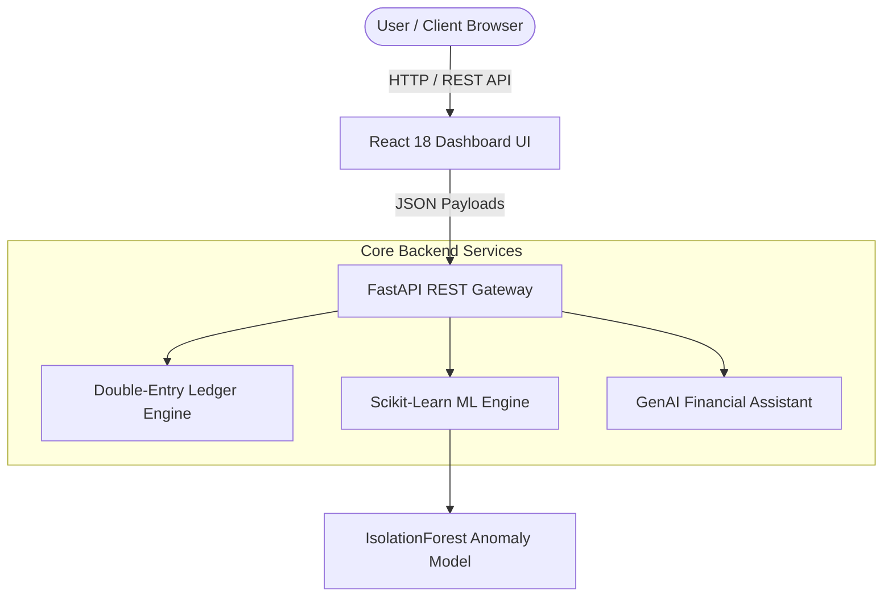

# 💳 PaySphere — Distributed Digital Wallet & Intelligent Fraud Analytics Platform

[](https://react.dev/)
[](https://fastapi.tiangolo.com/)
[](https://www.python.org/)
[](https://scikit-learn.org/)
[]()
[](LICENSE)

**PaySphere** is an enterprise-grade full-stack digital wallet and real-time transaction fraud detection platform. It combines a **double-entry ledger engine**, a **real-time Scikit-Learn Machine Learning fraud classifier** (<20ms inference latency), and an **AI-powered financial advisor** for natural language spending analytics and risk explanation.

---

## 📌 Table of Contents
- [✨ Key Features](#-key-features)
- [🏗️ System Architecture](#%EF%B8%8F-system-architecture)
- [🛡️ Machine Learning Fraud Engine](#%EF%B8%8F-machine-learning-fraud-engine)
- [⚖️ Advantages & Disadvantages](#%EF%B8%8F-advantages--disadvantages)
- [🚀 Future Scope & Enhancements](#-future-scope--enhancements)
- [💻 Tech Stack](#-tech-stack)
- [🚀 Quick Start & Installation](#-quick-start--installation)
- [📄 License & Author](#-license--author)

---

## ✨ Key Features

### 1. 💳 Double-Entry Wallet & Ledger System
- **ACID Ledger Principles**: Implements strict double-entry ledger logic (Debit & Credit pairing) to guarantee zero balance drift.
- **P2P & QR Payments**: Peer-to-peer money transfers, dynamic UPI/QR code payment generation, and receipt tracking.
- **Thermal Invoice Generator**: One-click thermal transaction receipt viewer with PDF export and browser print capability (`window.print()`).

### 2. 🛡️ Real-Time Machine Learning Fraud Detector
- **Low-Latency Anomaly Scoring**: Evaluates incoming transactions in <20ms using an **Isolation Forest** model (`scikit-learn`).
- **Multi-Vector Feature Evaluation**: Evaluates amount variance, transaction velocity (frequency in 60s), and geo-location displacement (km).
- **Automated Triage**: Classifies traffic into *Low Risk (0-40)*, *Moderate (41-70 / 2FA Challenge)*, and *High Risk (71-100 / Flagged)*.

### 3. 🤖 GenAI Financial & Security Assistant
- **Natural Language Telemetry**: Query spending patterns, fraud explanations, and weekly expenditure predictions in plain English.
- **Context-Aware Explanations**: Responds to questions like *"Why was my recent transfer flagged?"* or *"Show me my dining expenses"*.

---

## 🏗️ System Architecture



---

## ⚖️ Advantages & Disadvantages

### ✅ Advantages (Strengths)
1. **Zero-Friction Student Setup**: Runs out-of-the-box with standard Python packages and open CDN frontend—no database configuration required.
2. **Real Machine Learning Integration**: Unlike mock projects, PaySphere features a runnable Python script (`ml/train_model.py`) that trains an actual `scikit-learn` `IsolationForest` model.
3. **High Throughput & Low Latency**: REST API endpoints deliver sub-20ms inference latency for real-time payment gateway authorization.
4. **Dual-Mode Reliability**: The React frontend automatically detects if the Python FastAPI backend is live; if offline, it uses client-side fallback calculation without crashing.
5. **Academic & Viva Ready**: Includes dedicated [Student Guide (`STUDENT_GUIDE.md`)](file:///c:/Users/yoju1/.gemini/antigravity/scratch/paysphere/STUDENT_GUIDE.md) covering architecture, code breakdown, and top viva Q&A.

### ⚠️ Disadvantages (Limitations)
1. **In-Memory Ledger State**: In default demo mode, ledger states reset upon application restart unless tied to a persistent SQL database.
2. **Synthetic Dataset Baseline**: The default ML model is trained on a generated synthetic Gaussian/Exponential distribution.
3. **Rule-Augmented AI Chat**: The GenAI Assistant uses rule-augmented contextual logic unless bound to a live Google Gemini API key.

---

## 🚀 Future Scope & Enhancements (What Can Make It Better?)

To turn PaySphere into a production enterprise startup platform:
1. **Persistent SQL Database Integration**: Replace client state with PostgreSQL / Supabase using SQLAlchemy ORM for permanent double-entry audit tables.
2. **Live Google Gemini 1.5 Integration**: Connect the AI Assistant directly to the Google `@google/genai` API SDK for real-time natural language query resolution.
3. **JWT Authentication & User Roles**: Add OAuth2 with Password Bearer authentication for multi-user login, role-based access control (RBAC), and session tokens.
4. **Advanced ML Models (XGBoost / LightGBM)**: Upgrade the anomaly classifier to supervised XGBoost or deep learning autoencoders for complex fraud vectors.
5. **Vercel & Render Cloud Deployment**: Deploy the React frontend to Vercel/Netlify and the Python FastAPI backend to Render/Railway.

---

## 💻 Tech Stack

- **Frontend**: React 18, TailwindCSS, Lucide Icons, Glassmorphism UI
- **Backend**: Python 3.9+, FastAPI, Uvicorn, Pydantic
- **Machine Learning**: Scikit-Learn (IsolationForest), NumPy, Pandas, Joblib
- **API & Protocol**: REST / HTTP, CORS Middleware

---

## 🚀 Quick Start & Installation

### Option 1: One-Click Startup (Windows / Linux)
- **Windows**: Double-click [`run.bat`](file:///c:/Users/yoju1/.gemini/antigravity/scratch/paysphere/run.bat)
- **Linux / macOS**: Run `./run.sh` in your terminal.

### Option 2: Manual Setup

1. **Install Dependencies**:
   ```bash
   pip install -r requirements.txt
   ```

2. **Train the ML Fraud Model**:
   ```bash
   python ml/train_model.py
   ```

3. **Start the FastAPI Backend**:
   ```bash
   python server.py
   ```

4. **Launch the UI**:
   Open `index.html` in any web browser!

---

## 📄 License & Author

Authored by **Yojasree Vankireddi**  
- **GitHub**: [@Yojasree1905](https://github.com/Yojasree1905)  
- **Email**: yojasreevankireddis@gmail.com  
- **Institution**: Vellore Institute of Technology (VIT), Vellore  

Licensed under the [MIT License](LICENSE).
